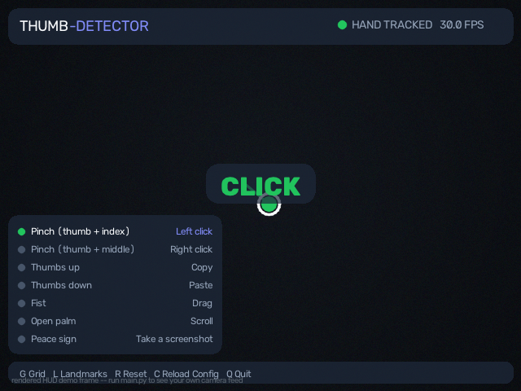
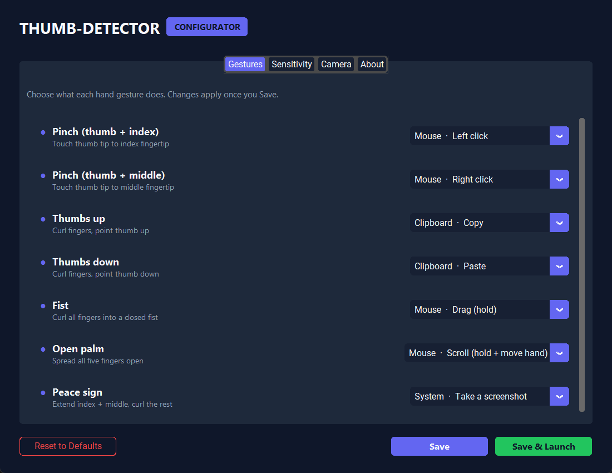

# Thumb-Detector

[](https://github.com/owenchlee/Thumb-Detector/actions/workflows/tests.yml)
[](https://www.python.org/)
[](LICENSE)

Scroll and react to short-form video feeds — Reels, Shorts, TikTok — with hand gestures, using nothing but a webcam.

Thumb-Detector tracks your hand in real time with MediaPipe and OpenCV. Point your index finger and flick it upward to advance to the next reel — no need to keep your hand raised the whole time. Thumbs up to like, a peace sign to open comments, hold a fist to bump playback to 2x speed, and a rock sign to go back to the previous reel. A companion desktop app lets you remap any gesture, or bind your own custom hotkey, without touching a line of code.

<p>
  
  
</p>

## Features

- **Flick-to-advance scrolling** — point your index finger and flick it upward; a single flick fires one fixed-size scroll pulse, so you only need to bring your hand into frame for a moment, not hold it up continuously.
- **Five recognized gestures** — point (next reel, flick up), rock sign (previous reel), thumbs up (like), peace sign (open comments), and a held fist (2x speed) — computed from MediaPipe's 21 hand landmarks using scale-invariant geometry (thresholds are relative to your hand's own size, so detection quality doesn't drift as you move closer to or farther from the camera). Next and previous are deliberately different gestures, not opposite directions of the same motion, so lowering a tired hand back down never gets misread as "go back."
- **Fully remappable** — any gesture can be reassigned to any action, or to a custom hotkey you type in yourself, via the configurator. No gesture-to-action pairing is hardcoded.
- **A real settings app**, not a config file you hand-edit — `configure.py` opens a dark-themed desktop GUI (CustomTkinter) to map gestures to actions, tune tracking sensitivity, and pick your camera, then save or save-and-launch straight into the tracker.
- **A live HUD**, not a bare video feed — the camera window shows which gesture is firing, what it's bound to, current FPS, hand-tracked status, and a flash confirmation for every action, so it doubles as a legend while you learn the gestures.
- **Hot-reloadable config** — press `C` in the tracker window to pick up changes saved from the configurator without restarting the camera.
- **Unit-tested gesture recognition** — the geometry that decides "is this a fist?" is pure, dependency-free logic, exercised by an automated test suite (see [Testing](#testing)) instead of only ever being eyeballed against a webcam.

## How it works

```
gesture_control/
├── hand_tracker.py   camera + MediaPipe wrapper (loads the model on a background thread)
├── gestures.py        pure geometry: landmarks -> {gesture_id: active?} (no cv2/mediapipe import)
├── actions.py          action registry + executor (mouse/keyboard IO is dependency-injected)
├── smoother.py          moving-average cursor smoothing
├── overlay.py            HUD rendering
├── config.py              gesture->action bindings, sensitivity settings, JSON load/save
├── theme.py                shared color/typography tokens used by both the HUD and the GUI
└── app.py                   main loop: wires the above together, entirely config-driven

configurator/gui.py    CustomTkinter settings window (reads/writes the same config.json)
main.py                entry point — runs the tracker
configure.py           entry point — opens the configurator
```

The main loop never hardcodes "thumbs up means like." Each frame it asks the gesture recognizer which of the five gestures are active, looks up what action `config.json` binds each one to, and dispatches generically based on that action's kind (an instant action like *Like*, a held action like *2x speed*, or a continuous one like *Scroll*). That's the mechanism the configurator's dropdowns plug into — remapping a gesture is just editing data, not code.

## Requirements

- Python 3.9+
- A webcam

Install the dependencies:

```bash
pip install -r requirements.txt
```

## Usage

**1. (Optional) Choose what your gestures do:**

```bash
python configure.py
```

Pick an action for each gesture, adjust sensitivity/camera settings, and hit **Save** — or **Save & Launch** to jump straight into the tracker.

**2. Run the tracker:**

```bash
python main.py
```

### Tracker window shortcuts

| Key | Action |
|-----|--------|
| `G` | Toggle the coordinate grid overlay (useful for debugging tracking) |
| `L` | Toggle the hand-skeleton overlay |
| `R` | Reset cursor smoothing |
| `C` | Reload `config.json` without restarting the camera |
| `Q` / `Esc` | Quit |

### Gesture reference

| Gesture | How to make it | Default action |
|---|---|---|
| Point | Extend your index finger, flick it upward | Next reel |
| Rock sign | Extend index + pinky, curl the middle two | Previous reel |
| Thumbs up | Curl your fingers, point your thumb up | Like |
| Peace sign | Extend index + middle, curl the rest | Open comments |
| Fist (hold) | Curl all fingers into a closed fist | 2x speed while held |

Your index fingertip always drives the cursor, regardless of bindings — aim it at a like/comment button before making that gesture, the same way you'd position a mouse before clicking.

Every binding above is a default, not a rule — open `configure.py` and change any of them.

## Testing

The gesture-recognition, config, smoothing, and action-dispatch logic is unit tested with `pytest` and has no dependency on a camera, a display, or MediaPipe/OpenCV being importable — tests build synthetic hand landmarks by hand and assert on the pure geometry.

```bash
pip install -r requirements-dev.txt
pytest
```

CI runs this same suite on every push (see the badge above).

## Notes

- The app moves your mouse cursor for as long as it's running. Keep the camera window focused and press `Q` to quit cleanly.
- Detection quality depends on lighting and camera angle. Good, even lighting on your hand gives the most reliable tracking.
- Like and Open Comments click at wherever your index finger is currently pointing, so aim at the on-screen button before making the gesture.

## License

MIT — see [LICENSE](LICENSE).
